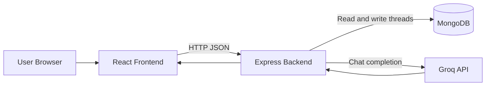

# SigmaGPT

SigmaGPT is a full-stack AI chat application with a React/Vite frontend, an Express backend, MongoDB thread storage, and Groq-powered assistant responses.

## Features

- Create and continue chat threads
- Persist conversations in MongoDB
- Generate replies with the Groq Chat Completions API
- Render assistant messages with Markdown and syntax highlighting
- View and delete saved threads

## Technology Stack

- Frontend: React 19 and Vite
- Backend: Node.js and Express 5
- Database: MongoDB with Mongoose
- AI provider: Groq API
- Groq model: `groq/compound-mini`

## Project Structure

```text
SIGMAGPT/
├── Backend/
│   ├── models/Thread.js
│   ├── routes/chat.js
│   ├── utils/groqai.js
│   ├── .env
│   ├── package.json
│   └── server.js
├── Frontend/
│   ├── src/
│   ├── public/
│   ├── package.json
│   └── vite.config.js
└── README.md
```

## Prerequisites

- Node.js 18 or newer
- npm
- A MongoDB database, such as MongoDB Atlas
- A Groq API key

## Configuration

Create `Backend/.env` with your own credentials:

```env
MONGODB_URI=mongodb+srv://<username>:<password>@<cluster>/<database>
GROQ_API_KEY=<your-groq-api-key>
```

Never commit API keys or database passwords to source control.

## Installation

Install backend dependencies:

```bash
cd Backend
npm install
```

In a second terminal, install frontend dependencies:

```bash
cd Frontend
npm install
```

## Running the Application

Start the backend from the `Backend` directory:

```bash
node server.js
```

The backend runs at `http://localhost:8080` after connecting to MongoDB.

Start the frontend from the `Frontend` directory:

```bash
npm run dev
```

Open the Vite URL shown in the terminal, usually `http://localhost:5173`.

Build and preview the frontend:

```bash
npm run build
npm run preview
```

## API Reference

All API routes are mounted under `/api`.

### `POST /api/chat`

Send a message and receive an assistant reply. A new thread is created when `threadId` does not already exist.

Request:

```json
{
  "threadId": "example-thread-id",
  "message": "Explain closures in JavaScript"
}
```

Response:

```json
{
  "reply": "..."
}
```

### `GET /api/thread`

Returns saved threads ordered by most recently updated.

### `GET /api/thread/:threadId`

Returns the messages for a specific thread.

### `DELETE /api/thread/:threadId`

Deletes a specific thread and returns a success message.

### `POST /api/test`

Creates a sample thread for checking MongoDB connectivity during development.

## Data Model

Each thread stores:

- `threadId`: unique application thread identifier
- `title`: first user message used as the thread title
- `messages`: ordered user and assistant messages
- `createdAt`: creation timestamp
- `updatedAt`: last update timestamp

## Architecture



## Troubleshooting

### Backend does not start

- Confirm `Backend/.env` contains `MONGODB_URI` and `GROQ_API_KEY`.
- Check the MongoDB connection string and Atlas network access settings.
- Run the server from the `Backend` directory.

### Chat returns an AI service error

- Confirm the Groq key is active and has not been revoked.
- Confirm the configured model is available to the key.
- Check the backend terminal for the Groq API error.

### Frontend cannot reach the backend

- Confirm the backend is running at `http://localhost:8080`.
- Confirm the frontend is running at `http://localhost:5173`.
- Check the browser Network tab for failed `/api` requests.

## Security

- Keep `Backend/.env` private and never commit it.
- Do not place backend credentials in frontend code.
- Rotate credentials immediately if they are exposed.
