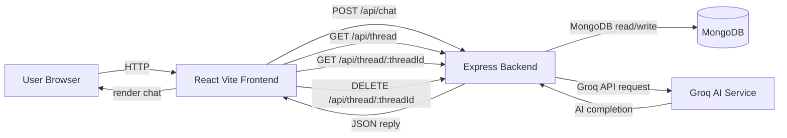

# SigmaGPT

A full-stack chat application built with React (Vite) frontend and Express/MongoDB backend. SigmaGPT stores chat threads and uses the Groq API to generate assistant replies.

## 🚀 Project Overview

- **Frontend:** React + Vite
- **Backend:** Node.js + Express
- **Database:** MongoDB via Mongoose
- **AI Service:** Groq API (`llama-3.3-70b-versatile`)
- **Features:**
  - create and continue chat threads
  - save chat history in MongoDB
  - render AI replies with Markdown + syntax highlighting
  - delete chat threads

## 📁 Project Structure

```
SIGMAGPT/
├── Backend/
│   ├── models/
│   │   └── Thread.js
│   ├── routes/
│   │   └── chat.js
│   ├── utils/
│   │   └── groqai.js
│   ├── package.json
│   └── server.js
└── Frontend/
    ├── public/
    ├── src/
    │   ├── App.jsx
    │   ├── Chat.jsx
    │   ├── ChatWindow.jsx
    │   ├── Sidebar.jsx
    │   ├── MyContext.jsx
    │   ├── main.jsx
    │   └── styles/*.css
    ├── package.json
    └── README.md
```

## 🧩 Architecture Diagram

### Mermaid diagram



### Plain-text working diagram

```
 User Browser
      |
      v
 React Vite Frontend
      |
      |-- POST /api/chat -----> Express Backend
      |                          |      |
      |                          |      +---> MongoDB (Thread storage)
      |                          |      |
      |                          |      +---> Groq AI Service
      |                          |              |
      |                          |              v
      |                          |         AI response
      |                          v
      |<-- JSON reply ----------
      v
 Render chat in browser
```

> Use the Mermaid section if your README viewer supports Mermaid diagrams. The plain-text diagram above will display everywhere.

## 🔧 Backend Setup

1. Open a terminal in `SIGMAGPT/Backend`
2. Install dependencies:
   ```bash
   npm install
   ```
3. Create a `.env` file with:
   ```env
   MONGODB_URI=your_mongodb_connection_string
   GROQ_API_KEY=your_groq_api_key
   ```
4. Start the backend server:
   ```bash
   node server.js
   ```

> If you want live reload during development and have `nodemon` installed, run:
> ```bash
> npx nodemon server.js
> ```

## 🌐 Frontend Setup

1. Open a terminal in `SIGMAGPT/Frontend`
2. Install dependencies:
   ```bash
   npm install
   ```
3. Start the app:
   ```bash
   npm run dev
   ```
4. Open the local Vite URL shown in the terminal (usually `http://localhost:5173`).

## 🧪 API Endpoints

### POST `/api/chat`
Send a user message and receive the AI assistant reply.

Request body:
```json
{
  "threadId": "<thread-id>",
  "message": "<user message>"
}
```

Response:
```json
{
  "reply": "<assistant reply>"
}
```

### GET `/api/thread`
Fetch all saved chat threads.

Response example:
```json
[
  { "threadId": "...", "title": "..." },
  ...
]
```

### GET `/api/thread/:threadId`
Fetch a specific thread's messages.

Response example:
```json
[
  { "role": "user", "content": "..." },
  { "role": "assistant", "content": "..." }
]
```

### DELETE `/api/thread/:threadId`
Delete a chat thread by ID.

Response example:
```json
{ "success": "Thread deleted successfully" }
```

## 🧠 Data Model

`Backend/models/Thread.js` defines:
- `threadId` (unique)
- `title`
- `messages` with `role`, `content`, and `timestamp`
- `createdAt`, `updatedAt`

## 📌 Notes

- The frontend connects to the backend at `http://localhost:8080`.
- The backend uses the Groq AI chat completions endpoint and requires a valid `GROQ_API_KEY`.
- Chat responses are rendered in Markdown, including code highlighting.

## 💡 Usage

- Click the sidebar button to start a new chat.
- Send messages in the input box.
- Switch between saved threads from the sidebar.
- Delete threads with the trash icon.

## 🛠️ Recommended Improvements

- Add error UI for failed requests.
- Support environment-specific backend URL configuration.
- Add backend scripts to `Backend/package.json`:
  - `start`: `node server.js`
  - `dev`: `nodemon server.js`

---

Built with ❤️ by the SigmaGPT project.
